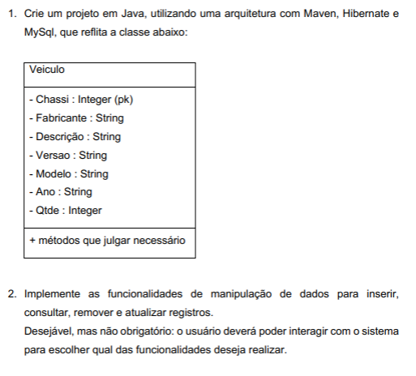

# Projeto: Sistema Veículo com JPA e Hibernate

Este é um projeto Java utilizando Maven, JPA, Hibernate e MySQL para gerenciar um sistema de veículos.

## Pré-requisitos

Antes de iniciar, certifique-se de que você possui as seguintes ferramentas instaladas no seu ambiente:

- **Java JDK 8+**: [Download Java](https://www.oracle.com/java/technologies/javase-downloads.html)
- **Apache Maven**: [Download Maven](https://maven.apache.org/download.cgi)
- **MySQL Server**: [Download MySQL](https://dev.mysql.com/downloads/)
- **Git**: [Download Git](https://git-scm.com/downloads)

## Passo a passo de configuração

### 1. Clonar o repositório

Abra o terminal ou command-line e execute o comando:

```bash
git clone <URL_DO_REPOSITORIO>
cd <PASTA_DO_PROJETO>
```

### 2. Criar o schema no MySQL

Abra o MySQL no terminal e execute os seguintes comandos para criar o schema:

```sql
mysql -u root -p
CREATE DATABASE orm_p2;
USE orm_p2;
```

### Configurar o banco de dados no **persistence.xml**

No arquivo src/main/java/www/br/luiz/atv2, o persistence.xml já está configurado para se conectar ao banco MySQL com as seguintes propriedades:

```xml
<property name="javax.persistence.jdbc.url" value="jdbc:mysql://localhost/orm_p2?useSSL=false&amp;serverTimezone=UTC" />
<property name="javax.persistence.jdbc.driver" value="com.mysql.jdbc.Driver" />
<property name="javax.persistence.jdbc.user" value="root" />
<property name="javax.persistence.jdbc.password" value="123456" />
```

#### Atenção:

- Certifique-se de que o usuário e senha do MySQL correspondem às configurações acima.
- Caso necessário, ajuste a senha e outros parâmetros de conexão no **persistence.xml.**

### 4. Build e instalação das dependências

Dentro do diretório do projeto, execute o Maven para baixar as dependências:

```bash
mvn clean install
```
Isso irá baixar todas as dependências, incluindo o hibernate-core, hibernate-entitymanager, e mysql-connector-java.

### 5. Executar o projeto

Após configurar o banco de dados e instalar as dependências, você pode executar a aplicação. Navegue até a classe principal:

```bash
cd src/main/java/www/br/luiz/atv2

# E execute o projeto:
java Main
```

### 6. Estrutura do Projeto

```plaintext
src/
│
├── main/
│   └── java/
│       └── www/
│           └── br/
│               └── luiz/
│                   └── atv2/
│                       ├── DeleteSchema.java
│                       ├── FindSchema.java
│                       ├── InputUsuario.java
│                       ├── InsertSchema.java
│                       ├── Main.java
│                       ├── UpdateSchema.java
│                       └── Veiculo.java
└── resources/
    └── META-INF/
        └── persistence.xml
```

### 7. Dependências Utilizadas

As seguintes bibliotecas são utilizadas no projeto e são gerenciadas pelo Maven:
- Hibernate Core: 5.6.15.Final
- Hibernate Entity Manager: 5.6.15.Final
- MySQL Connector: 8.0.28

### 8. Problemas comuns
- Erro de conexão com o banco: Verifique se o MySQL está rodando e se as configurações no persistence.xml estão corretas.
- Dependências não instaladas: Execute mvn clean install novamente para garantir que todas as dependências estão instaladas corretamente.

### Atividade


## Sobre
Autor: Luiz Antônio de Souza
Contato: luiz.antoniodesouza004@gmail.com
Descrição: esse foi uma ativade desenvolvida em sala de aula
